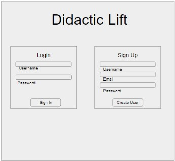
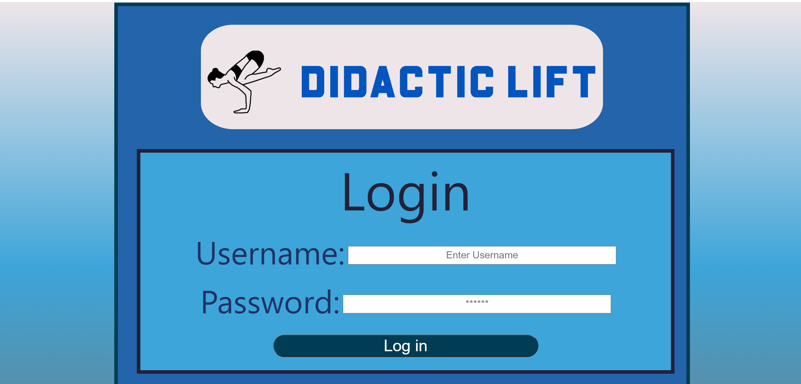
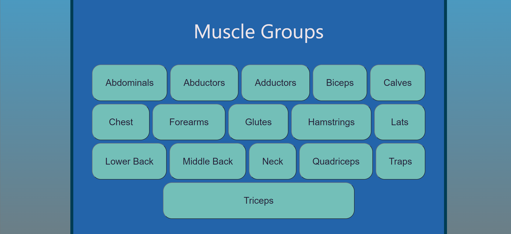
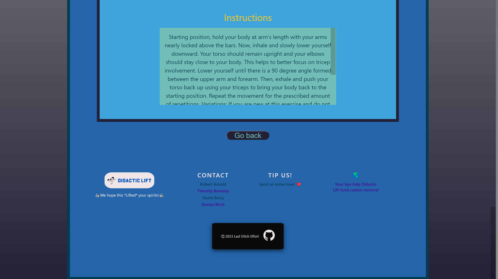

# Didactic Lift

 

## Description

Welcome to Didactic Lift, a must-have app for the athletic and health-minded! Brought to you by Team Last Ditch Effort.

Search by muscle groups to find new exercises to target those hard-to-reach areas, and save workout routines to your profile.

 

## Members of Team Last Ditch Effort

| Member          |                                                                       Contact Links                                                                       |
| --------------- | :-------------------------------------------------------------------------------------------------------------------------------------------------------: |
| Timothy Barnaby |              [Github](https://github.com/tbarns) // [📧email](mailto:tbarnaby1@gmail.com) // [LinkedIn](https://www.linkedin.com/in/tbarns/)              |
| Dorian Birch    | [Github](https://github.com/206Dorian) // [📧email](mailto:206dorian@gmail.com) // [LinkedIn](https://www.linkedin.com/in/dorian-douglas-birch-70695b4b/) |
| David Berry     |    [Github](https://github.com/dberry38) // [📧email](mailto:davidberry38@gmail.com) // [LinkedIn](https://www.linkedin.com/in/david-berry-122b5787/)     |
| Robert Arnold   | [Github](https://github.com/YogiBruce) // [📧email](mailto:da.bruce.jr@gmail.com) // [LinkedIn](https://www.linkedin.com/in/robert-b-arnold-jr-8285b161/) |

 

## Deployed Site

[Come check us out!](https://didactic-lift.herokuapp.com)
https://didactic-lift.herokuapp.com/

 

## Technologies Used

- HTML, CSS, Javascript
- Express.js
- React
- MongoDB
- Apollo
- GraphQL
- JWT
- Stripe

 

## Usage
    -The user can easily login or create a new profile. Once they’re logged in, they will be able to update their personal info. 
    -From the profile page, the user can then select a muscle-group and they’re instantly provided 10 different exercises.
    -They’re also provided with everything they need to know to complete each exercise including difficulty, needed equipment, and even helpful instructions!  

 

## Development 

Easy to use login / signup page:
 

  
Profile page displaying user data and buttons. Selecting buttons to render list of exercises.
 

 

## Screenshots

  

  

  

## Future Development

- Option to search/ view yoga exercises

- Find a DL workout buddy locally
    
- Rate the gyms where you’ve worked out
    
- Rate workouts/ yoga poses you've tried
     
- Track specifics (how well you slept the night before, what time of day you worked out to see your optimal workout times, stress and anxiety levels)
     
- Input your body type, weight and what body type you are working towards
     
- If you have an injury or muscle group you are trying to avoid
     
- Dark mode

 
